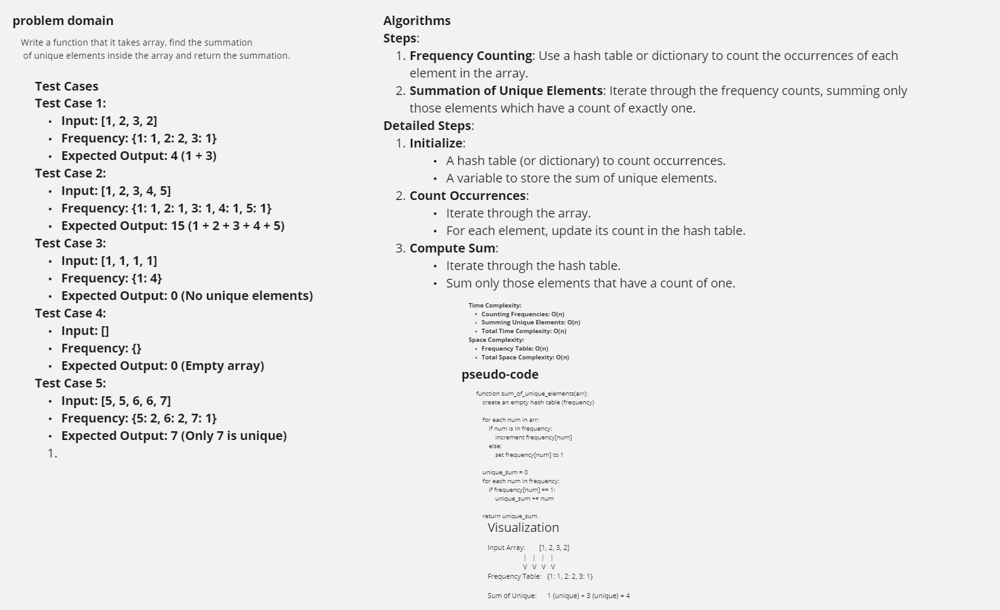

# Hash Table:

## Challenge03 - Sum Of Unique Elements:
 Write a function that it takes array, find the summation of unique elemts inside the array and return the summation.</p>
<br>
<strong>Unique elements of an array are the elements that appear exactly once in the array.</strong>

## Example 1:

Input
<pre> nums = [1,2,3,2]</pre>


Output:
```python
4
```
<br>

## Example 2:

Input
<pre> nums = [1,2,3,4,5]</pre>


Output:
```python
15
```
<br>

# white Board



