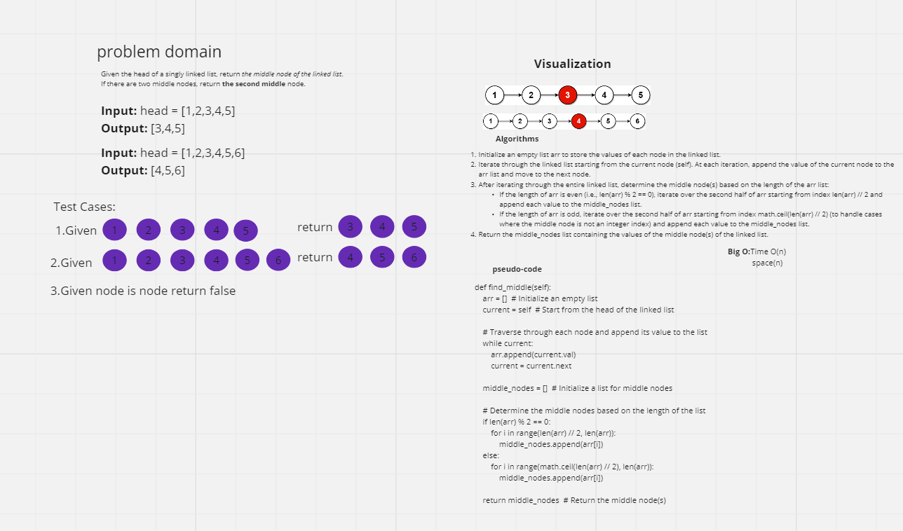

# Find Middle Node(s) in a Singly-Linked List

This code challenge involves implementing a function to find the middle node(s) in a singly-linked list.

## Problem Statement

You are given a singly-linked list, and you need to find the middle node(s) of the list. If the list has an even number of nodes, return the second middle node.

## Solution Approach

To solve this problem, we can iterate through the linked list and collect the values of each node in an array. Then, based on the length of the array, we determine the middle node(s). If the length is even, we return the second middle node; otherwise, we return the middle node.

## White Board

