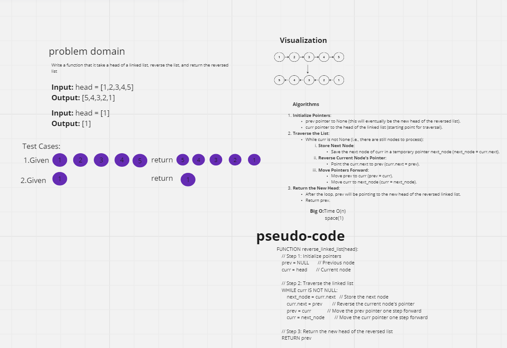

# Linked List Reversal

This repository contains a Python implementation to reverse a singly linked list.

## Implementation

The solution involves creating a `ListNode` class that represents each node in the linked list and includes a method `reverse_linked_list` to reverse the linked list.

### ListNode Class

- **`__init__(self, val)`**: Initializes a `ListNode` with the given value.
- **`reverse_linked_list(self)`**: Reverses the linked list starting from the current node and returns the head of the reversed list.

### Algorithm for Reversing the Linked List

1. **Initialize Pointers**: 
    - `prev` pointer to `None` (this will eventually be the new head of the reversed list).
    - `curr` pointer to the head of the linked list (starting point for traversal).

2. **Traverse the List**: 
    - While `curr` is not `None` (i.e., there are still nodes to process):
        1. **Store Next Node**: 
            - Save the next node of `curr` in a temporary pointer `next_node` (`next_node = curr.next`).
        2. **Reverse Current Node's Pointer**: 
            - Point the `curr.next` to `prev` (`curr.next = prev`).
        3. **Move Pointers Forward**: 
            - Move `prev` to `curr` (`prev = curr`).
            - Move `curr` to `next_node` (`curr = next_node`).

3. **Return the New Head**: 
    - After the loop, `prev` will be pointing to the new head of the reversed linked list.
    - Return `prev`.

### Time and Space Complexity

- **Time Complexity**: `O(n)`
- **Space Complexity**: `O(1)`

## white board

