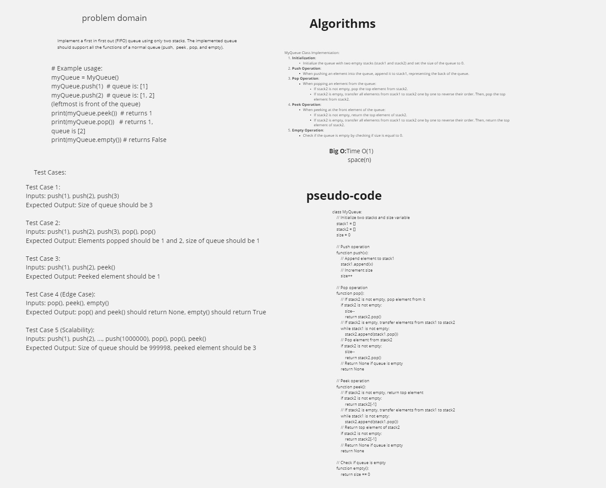

# MyQueue: Implementation of Queue Using Two Stacks

## Overview

This repository contains the implementation of a queue data structure using two stacks in Python. The `MyQueue` class provides standard queue operations such as push, pop, peek, and empty. It achieves the FIFO (First-In-First-Out) behavior by utilizing two Last-In-First-Out (LIFO) stacks.

## Features

- Efficient implementation of a queue using two stacks.
- Supports standard queue operations: push, pop, peek, and empty.
- Implemented in Python, ensuring simplicity and ease of use.

## How to Use

1. **Clone the Repository**:

   ```
   git clone <repository_url>
   ```

2. **Import the `MyQueue` Class**:

   ```python
   from challenge01 import MyQueue
   ```

3. **Create an Instance of `MyQueue`**:

   ```python
   my_queue = MyQueue()
   ```

4. **Perform Queue Operations**:

   ```python
   my_queue.push(1)
   my_queue.push(2)
   print(my_queue.peek())    # Output: 1
   print(my_queue.pop())     # Output: 1
   print(my_queue.empty())   # Output: False
   ```

## Test Cases

- Test cases for the `MyQueue` class implementation can be found in the `test_challenge01.py` file.
- Run the tests using a testing framework like `pytest`:

  ```
  pytest test_challenege01.py
  ```

## white board


