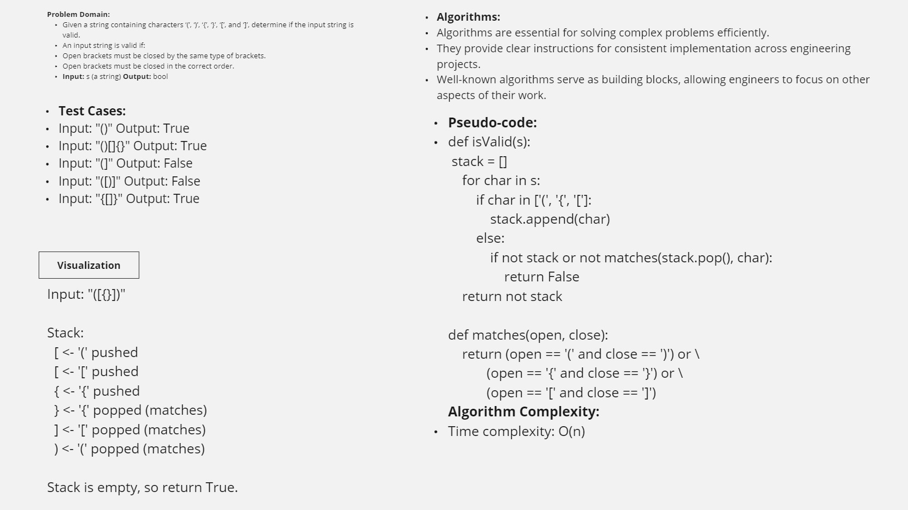

Sure, here is a `README.md` file for this code:

### `README.md`
```markdown
# Bracket Validator

This project contains a Python function to check if a string of brackets is valid. The function `is_valid` verifies if the brackets in the input string are properly closed and nested. The project also includes tests using the `pytest` framework.

## Function Description

The `is_valid` function takes a string `s` containing just the characters '(', ')', '{', '}', '[' and ']', and determines if the input string is valid.

A string is considered valid if:
1. Open brackets are closed by the same type of brackets.
2. Open brackets are closed in the correct order.

### Usage

You can use the `is_valid` function by importing it from the `bracket_validator.py` file.

```python
from bracket_validator import is_valid

# Example usage
print(is_valid("()"))         # Output: True
print(is_valid("()[]{}"))     # Output: True
print(is_valid("[({}]"))      # Output: False
print(is_valid("[(hello)()]")) # Output: True
print(is_valid("[{(())}]"))   # Output: True
```

### Running Tests

Tests are included in the `test_challenge02.py` file. To run the tests, you need to have `pytest` installed. You can install it using pip:

```sh
pip install pytest
```


Example output:

```
Test case '()': True
Test case '()[]{}': True
Test case '[({}]': False
Test case '[(hello)()]': True
Test case '[{(())}]': True
```


