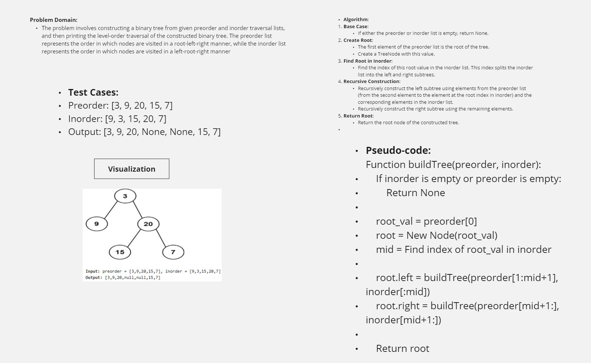

Usage
To use the tree_builder.py script programmatically, import the necessary functions and classes:

python
Copy code
from tree_builder import TreeNode, buildTree, print_level_order

# Example usage:
preorder = [3, 9, 20, 15, 7]
inorder = [9, 3, 15, 20, 7]
root = buildTree(preorder, inorder)
print("Level Order Traversal:", print_level_order(root))
Functions
TreeNode Class
Defines a binary tree node with attributes val, left, and right.

buildTree Function
Constructs a binary tree from given preorder and inorder traversal lists.

Input: preorder (list) - Preorder traversal of the binary tree.
inorder (list) - Inorder traversal of the binary tree.
Output: Returns the root node of the constructed binary tree.
print_level_order Function
Returns the level order traversal of a binary tree.

Input: root (TreeNode) - Root node of the binary tree.
Output: Returns a list representing the level order traversal of the binary tree.

## White board
