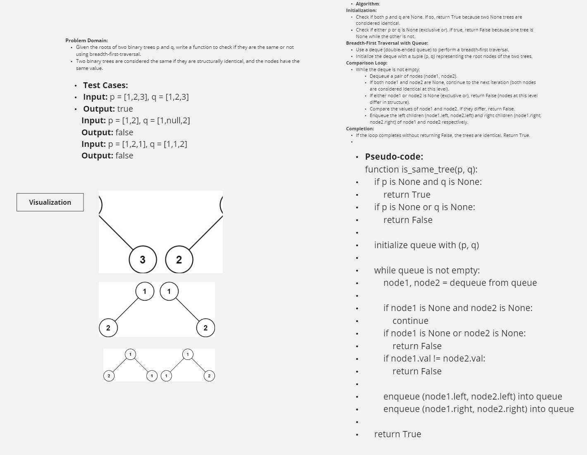

## Binary Tree Structure Comparison

This Python script provides functionality to compare whether two binary trees are structurally identical and have the same node values.

### `is_same_tree(p, q)` Function

This function takes two parameters `p` and `q`, which represent the root nodes of two binary trees. It performs a breadth-first traversal using a queue to compare their structures and node values.

**Parameters:**

- `p` (TreeNode or None): Root node of the first binary tree.
- `q` (TreeNode or None): Root node of the second binary tree.

**Returns:**

- `True` if both trees are structurally identical and have the same node values.
- `False` otherwise.
## white board
